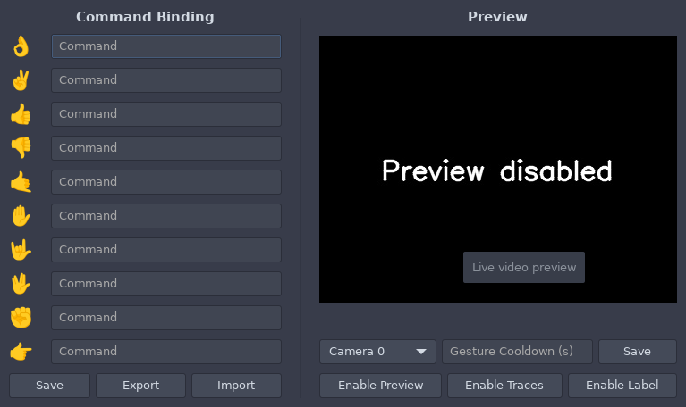

# GestureX 

GestureX enables you to control your Linux PC using hand gestures. You can assign specific commands or functionalities to different hand gestures, allowing for hands-free interaction with your computer.

## Features

- Recognizes hand gestures using a webcam
- Maps hand gestures to custom commands or functionalities
- Real-time preview of webcam feed with hand gesture recognition
- Easily configurable through a graphical user interface

## Installation

1. Clone the repository:

    ```bash
    git clone https://git.0x7f.in/sarthak/GestureX.git
    ```

2. Install the required dependencies:

    ```bash
    pip3 install opencv-python numpy mediapipe tensorflow PyGObject 
    ```

3. Run the application:

    ```bash
    python3 gui.py
    ```

## Usage

1. Launch the application.
2. Define hand gestures and assign commands or functionalities to them through the graphical user interface.
3. Perform the defined hand gestures in front of your webcam to trigger the corresponding commands or functionalities.

## Supported Hand Gestures

- "Okay" gesture
- "Peace" sign
- Thumbs up
- Thumbs down
- "Call me" gesture
- Stop gesture
- Rock and roll sign
- Fist
- Smile hand gesture
- "Live long and prosper" Vulcan salute

## Screenshots


## Credits

This project utilizes the hand gesture recognition model provided by the [Google MediaPipe project](https://github.com/google/mediapipe).

## License

This project is licensed under the MIT License - see the [LICENSE](LICENSE) file for details.

